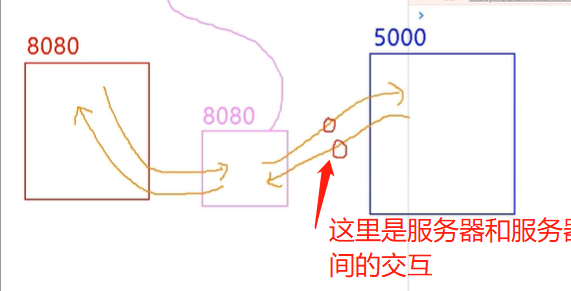

# Vue中的ajax

## 开发环境跨域问题

### 跨域

同源策略：客服端发送了请求给服务器，服务器也受到了请求，也返回了，但是没返回客户端需要的数据，返回了错误信息。

解决跨域的方法：

- cors:在服务器端设置特殊的响应头，加载返回给客户端的数据上，无需前端；

- jsonp:借助script标签的src属性 在引入外部资源时资源时不受同源策略限制的情况

  需要前后端一起配合，只能解决`get`请求，其他请求不行

- 配置代理服务器

  代理服务器和客户端所处的域名的相同

  

  ajax是前端技术，是浏览器和服务器之间进行的交互

  两台服务器之间交互不使用ajax技术，而是使用http请求

  

  开启代理服务器的方法：

  - `nginx`

  - `vue-cli`借助vue的脚手架开启代理服务器

    ```js
      // 开启代理服务器,
      devServer: {
        // 代理服务器把请求转发给谁
        proxy: 'http://localhost:5000'
      }
    ```
  
    配置代理的方式简单,但是有缺陷：

    - 不能配置多个代理

    - 不能灵活的控制是否走代理

代理服务8080不是把所有资源转发给5000，

如果本地服务器中有对应资源(public目录下的资源)，那么就不会转发给5000

### 配置代理的方式

使用`vue-cli`工具,编写`vue.config.js`文件配置代理。

#### 方法一

```js
  // 开启代理服务器,
  devServer: {
    // 代理服务器把请求转发给谁
    proxy: 'http://localhost:5000'
  }
```

说明：

1. 优点：配置简单，请求资源时直接发给前端（8080）即可。

2. 缺点：不能配置多个代理，不能灵活的控制请求是否走代理。

3. 工作方式：若按照上述配置代理，当请求了前端不存在的资源时，那么该请求会转发给服务器 （优先匹配前端资源）

   

#### 方法二

`vue.config.js`

```js
module.exports = {
	devServer:{
        proxy:{
            // 配置请求路径前缀为'/api1'的代理
            '/api1':{
                // 代理目标的基础路径
                target: 'http://localhost:5000',
                // 修改代理发送到目标服务器的路径,去掉/api1这几个字符
                pathRewrite: {'^/api1': ''}
                changeOrigin: true,
                
            },
             // 配置请求路径前缀为'/api2'的代理
            '/api2':{
                target: 'http://localhost:5001',// 代理目标的基础路径
                changeOrigin: true,
                // 修改代理发送到目标服务器的路径,去掉/api2这几个字符
                pathRewrite: {'^/api2': ''}
            }
        }
    }
}
```

- `pathRewrite`保证代理发送给目标服务器的路径不带有`/api2`路径

- `ws`：用于支持`websocket`

- `changeOrigin`：控制服务器的`host`字
  - `true`时，服务器收到的请求头中的host为：localhost:5000，**使用目标服务器的host**,**默认**
  - `false`时，服务器收到的请求头中的host为：localhost:8080，**使用代理服务器自己本身的host**

- 说明：

  - 优点：可以配置多个代理，且可以灵活的控制请求是否走代理。

  * 缺点：配置略微繁琐，请求资源时必须加前缀。

## github用户搜索案例

https://www.bilibili.com/video/BV1Zy4y1K7SH?p=98&spm_id_from=pageDriver&vd_source=dde2f4dd432156027fedf9b1734ba705


## slot插槽

